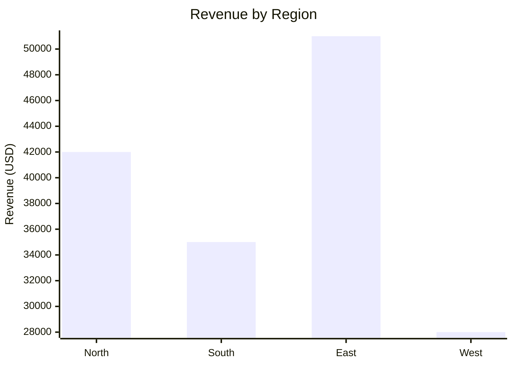
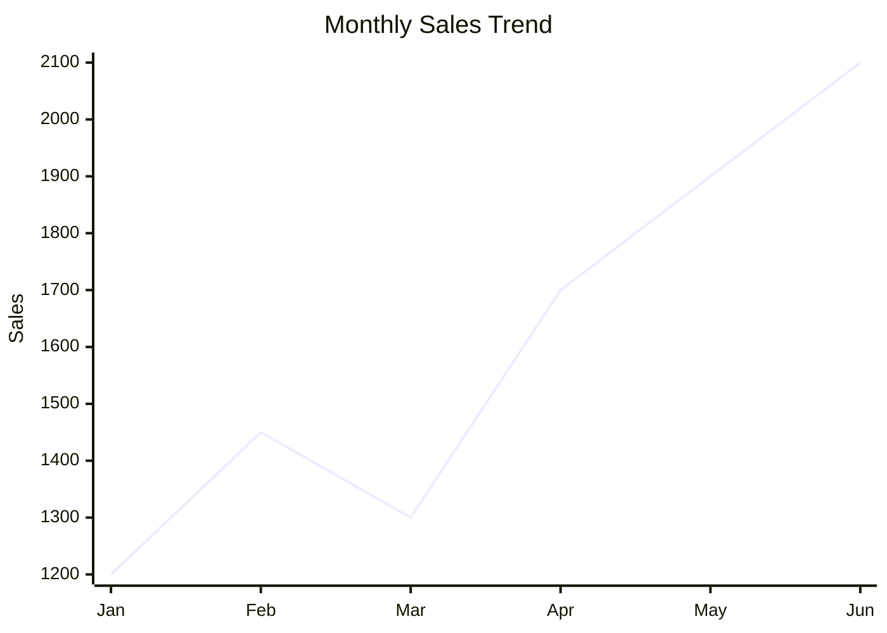
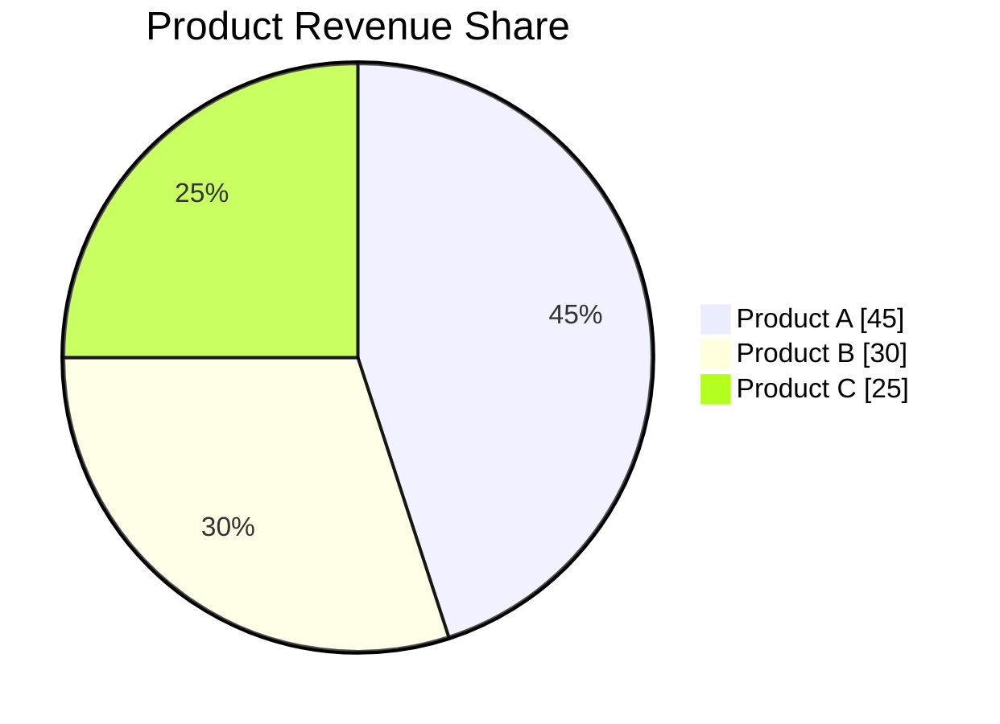
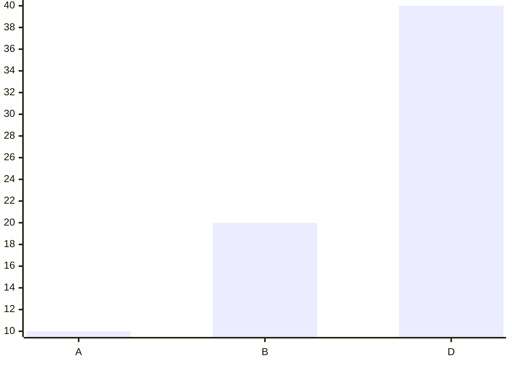

# Mermaid Chart System

This document describes how the Sales Intel Agent generates, renders, and embeds
Mermaid diagrams in both the streaming response and the PDF report.

---

## Overview

Mermaid charts are **conditionally generated** based on the user's intent.

The `needs_visualization` flag is set to `True` when the user's query contains
chart/graph keywords (e.g. `"show me a bar chart"`, `"visualize"`, `"plot"`).
When `False`, the LLM produces a text-only analysis with no Mermaid blocks.

```
User Query
    │
    └─ contains CHART_KEYWORDS?
         Yes → needs_visualization = True  → generate_visualization: true  → LLM includes Mermaid blocks
         No  → needs_visualization = False → generate_visualization: false → LLM text-only output
```

---

## Supported Chart Types

The BI report writer LLM selects the most appropriate chart type based on the
data and `chart_metadata` from the Stage 1 analysis plan.

### Bar Chart — comparisons, rankings, top/bottom performers



### Line Chart — trends, time-series, growth analysis



### Pie Chart — proportions, market share, contribution analysis



---

## Rendering Pipeline

When `needs_pdf = True`, each Mermaid block in the streamed Markdown is rendered
to a PNG image before being embedded in the PDF report:

```
Accumulated Markdown (from Stage 2 LLM stream)
      │
      ▼
re.split on ```mermaid ... ``` fences
      │
      ├─ Text segments  →  ReportLab Paragraph / Heading flowables
      │
      └─ Mermaid segments
              │
              ▼
        render_mermaid_to_png(mermaid_code)
              │
              ├─ Write .mmd temp file
              ├─ Run: mmdc -p puppeteer-config.json -i <mmd> -o <png> -b white
              └─ Return (png_path, mmd_path)
                      │
                      ▼
              fit_image(png_path, max_width, max_height=350)
                      │
                      ▼
              ReportLab Image flowable → embedded in PDF page
                      │
                      ▼
              Cleanup: os.remove(png_path), os.remove(mmd_path)
```

---

## Null / NaN Handling Rules

The LLM is instructed (via `bi_report_writer.md`) to clean chart data before
outputting any Mermaid block:

1. Remove all `null`, `NaN`, and `undefined` values from series arrays.
2. Remove the corresponding x-axis label for every removed value.
3. Verify that every series has exactly the same length as the x-axis.
4. If validation fails, regenerate the chart before responding.

**Example — before cleaning:**

```
x-axis ["A", "B", "C", "D"]
bar    [10,  20,  null, 40]
```

**Example — after cleaning:**



---

## Mermaid CLI Configuration

The `mmdc` binary is invoked with a Puppeteer config that controls the headless
Chrome instance used for rendering:

| Setting | File | Default |
|---------|------|---------|
| Puppeteer config JSON | `app/services/puppeteer-config.json` | Bundled default |
| Custom override path | `PUPPETEER_CONFIG_PATH` env var | `""` (use bundled) |
| Background colour | `-b white` flag in CLI call | White |
| Output format | `.png` | PNG |

To use a custom Puppeteer config (e.g. for a different Chrome executable path),
set `PUPPETEER_CONFIG_PATH=/path/to/your-config.json` in your `.env`.

---

## When Mermaid is NOT Generated

- `needs_visualization = False` — user did not ask for a chart/graph.
- `needs_pdf = False` — even if charts appear in the streamed Markdown, no rendering
  is triggered unless the user also requested a downloadable PDF.
- Empty or insufficient `query_result` — the LLM skips the chart block for that
  analysis section per the Data Availability rules in `bi_report_writer.md`.
- Invalid data (all-null values, mismatched array lengths) — the LLM regenerates
  or omits the block.

---

## Adding a New Chart Type

The LLM selects chart type autonomously. To support a new Mermaid diagram type:

1. Add an example and rules for the new type in `prompts/agents/bi_report_writer.md`
   under the `# CHART RULES` section.
2. If the new type requires specific data shaping, add instructions in the
   `# NULL VALUE HANDLING` and `# VALIDATION CHECK` sections of the same prompt.
3. No code changes are required — the prompt drives all chart generation logic.
